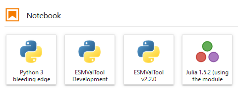

# ESMValTool-JupyterLab

Examples and instructions for using ESMValTool in a Jupyter environment

## Introduction

Recently we have started implementing a Python API for ESMValTool. This allows users to easily access, repeat, and build upon, existing climate analytics workflows. This is especially useful on federated climate data and analytics servers, such as the Mistral in Germany or JASMIN in the UK. You can just log in through your browser and have instant access to both the climate data and the analytics.

This repository contains examples of how the ESMValTool can be used in a notebook environment. For more information on the ESMValTool API, also see the [ESMValTool documentation](https://docs.esmvaltool.org/projects/esmvalcore/en/latest/api/esmvalcore.api.html). Below, we provide instructions for setting up an ESMValTool kernel in your Jupyter environment.



## ESMValTool on Mistral

Mistral is the HPC system offered by the German climate computing centre DKRZ. It offers a Jupyter environment that is available through https://jupyterhub.dkrz.de. On the [documentation pages](https://jupyterhub.gitlab-pages.dkrz.de/jupyterhub-docs/index.html) you can find all instructions you need for setting up your account and also for installing custom kernels. Here, we assume you have an account, and we will just show the specific steps needed for setting up an ESMValTool kernel.

1. Go to https://jupyterhub.dkrz.de, and log in.
2. Request a modest job on the prepost partition (because internet access is needed), with a JupyterLab interface.
3. Start a console and activate a standard python environment so you have access to conda: `module load python3/unstable`
4. Create an ESMValTool environment: `conda create --prefix $HOME/kernels/esmvaltool -c esmvalgroup -c conda-forge esmvaltool-python ipykernel`
5. Activate the conda environment: source activate `$HOME/kernels/esmvaltool`
6. Register the kernel to add it to JupyterLab: `python -m ipykernel install --user --name ESMValTool --display-name="ESMValTool"`
7. Copy and modify the config file: `esmvaltool config get_config_user` && `nano ~/.esmvaltool/config-user.yml`. Uncomment the default data locations for DKRZ (nano is a simple command line editor, you may also choose your own. In Nano, save with `ctrl+o` and exit with `ctrl+x`).
8. Stop the JupyterHub session (via file --> hub control panel) and spawn a new session

Note that this only installs the recipes with diagnostic scripts written in Python. If you want to use diagnostics written in other languages as well, you can add e.g. `esmvaltool-ncl` to the command in step 4. For Julia you need to make sure that you also have a Julia installation available (e.g. `module load julia`).

#### Development installation

Sometimes you might want to use recent features that have not yet made it into an official ESMValTool release. In that case, you can install a development version of ESMValTool, and link a kernel to it. For example:

1. Follow steps 1-7 of the default installation above (maybe change the display name to ESMValTool-Development).
2. Clone the ESMValCore repository: `git clone https://github.com/ESMValGroup/ESMValCore.git`
3. Install a editable version of ESMValCore: `cd ESMValCore && pip install -e . && cd ..`
4. Clone the ESMValTool repository: `git clone https://github.com/ESMValGroup/ESMValTool.git`
5. Install a editable version of ESMValTool: `cd ESMValTool && pip install -e . && cd ..`
6. To update the environment, simply navigate to the repository and `git pull` the latest changes.

#### Using a custom kernel script

It is also possible to start the Jupyter kernel from a custom script. This could be useful e.g. if you want to use `!` calls from the Jupyter notebook, and you want to make sure the underlying shell uses the same ESMValTool installation. To this end:

1. Follow steps 1-7 of the default installation.
2. Create a file `start-kernel.sh`, make it executable (`chmod +x start-kernel.sh`), and add the following content:

```sh
#!/bin/bash

source /etc/profile

module load python3/unstable
source activate $HOME/kernels/esmvaltool
python -m ipykernel_launcher -f "$1"
```

3. `jupyter kernelspec list` will give the path to `kernel.json`. Edit this file so that it looks like this:

```json
{
 "argv": [
  "/full/path/to/start-kernel.sh",
  "{connection_file}"
 ],
 "display_name": "ESMValTool",
 "language": "python"
}
```
make sure to modify the path to wherever you created `start-kernel.sh`!

4. The custom kernel should now be available.

#### Troubleshooting

- `jupyter kernelspec list` will validate the `kernel.json` file. If anything is wrong with that one, this command may provide useful error messages
- The slurm log file (by default named `jupyterhub_slurmspawner_...` contains error messages that may help debug the `start-kernel.sh` file

#### Ask for help

If you have any questions about using or installing ESMValTool, please find us, ideally through GitHub. There is for example the [ESMValTool discussions page](https://github.com/ESMValGroup/ESMValTool/discussions), you may [open an issue](https://github.com/ESMValGroup/ESMValTool/issues/new), or send an email to the [mailing list](https://docs.esmvaltool.org/en/latest/introduction.html#mailing-list).
